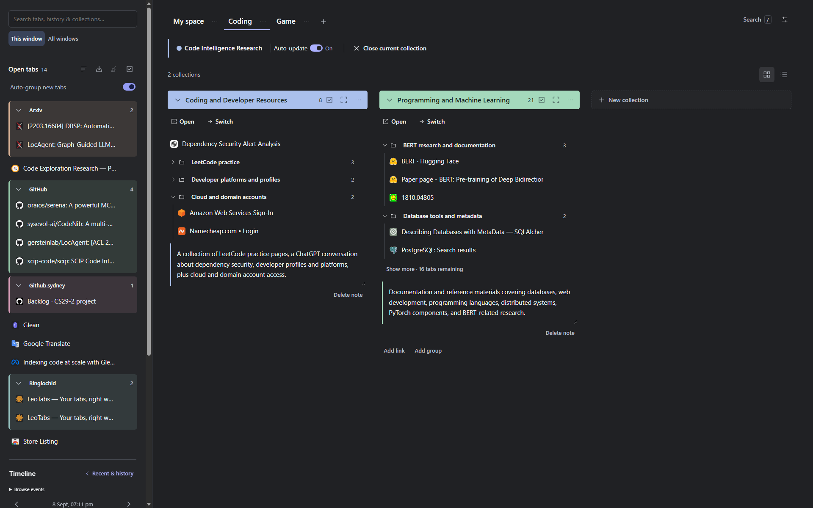
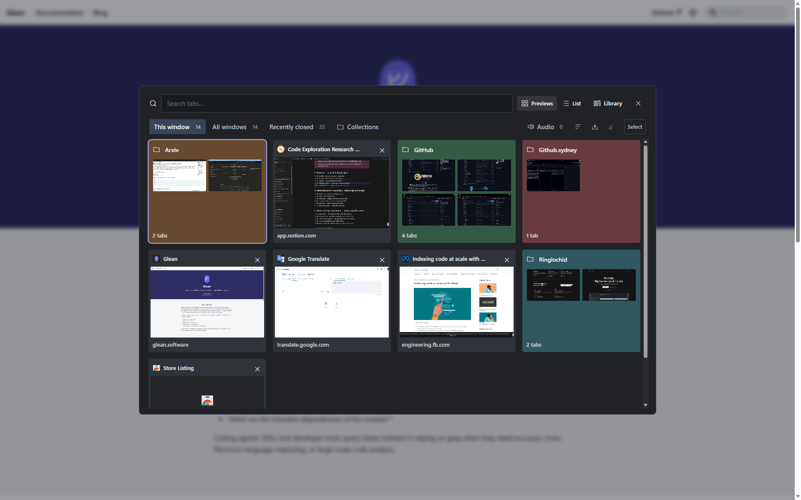

# LeoTabs

A tab manager and keyboard switcher for Chrome and Edge. Save tabs as collections, organise them into spaces, and reopen a project when you're ready to continue.

[Add to Chrome](https://chromewebstore.google.com/detail/leotabs/heolckkdeandgagkiefggcneodniojhb) · [User guide](https://ringlochid.me/leotabs/docs/) · [Website](https://ringlochid.me/leotabs/) · [Contribute](#contribute)



## Features

- **Find a tab quickly.** Use the visual switcher or search open tabs, saved links and recently closed pages.
- **Save work by project.** Keep links, groups, colours and notes in collections, with spaces for different areas of your work.
- **Pick up where you left off.** Open a collection or switch the current window to it. Auto-update can keep its saved links in step with your open tabs.
- **Organise your tabs.** Drag tabs, groups, collections and spaces into order. Group by website, sort, or close duplicate tabs.
- **Recover earlier work.** Undo supported changes, reopen recently closed pages, and restore snapshots from Timeline or collection version history.
- **Take your library with you.** Export backup JSON, bookmark HTML or Markdown. Import saved links and backups, or export collections to Notion.

LeoTabs is free to use. Everyday tab management works without an account or an AI connection.

## Install

Use Chrome 123 or newer, or a compatible Chromium browser such as Edge.

1. Open [LeoTabs in the Chrome Web Store](https://chromewebstore.google.com/detail/leotabs/heolckkdeandgagkiefggcneodniojhb) and choose **Add to Chrome**. In Edge, allow extensions from other stores if prompted.
2. Confirm **Add extension** in the browser's installation dialog.
3. Pin LeoTabs from the extensions menu, then click the lion to open the library.

The store installation does not need Developer mode or Node.js. For a development copy, use [Run locally](#run-locally).

Moving from an unpacked copy? Export **Settings → Export & import → Backup JSON** from that copy first. Install the store version, import the backup and check your collections before removing the old installation. [Migration instructions](https://ringlochid.me/leotabs/docs/import-export/).

## Save your first collection

1. Open a few web pages and open LeoTabs.
2. Choose **Save tabs** beside **Open tabs**. Select individual tabs first if you only want to save some of them.
3. Leave **and close them** unchecked to keep browsing, or check it to close the saved tabs. **and switch to new collection** makes the new collection current without reopening those tabs; the two options are mutually exclusive.
4. Choose **Save tabs** or **Stash tabs**, then name the new collection and add a note about where you stopped.

To add tabs to an existing collection, drag them from Open tabs into that collection. The original browser tabs stay open.

Choose **Open** to add its saved pages to your browser, or **Switch** to make it the current collection in that window. Switch lets you decide what to save from the outgoing work; pinned tabs stay open. See [Saving and switching](https://ringlochid.me/leotabs/docs/saving-switching/).

## Keyboard shortcuts

| Shortcut | Action |
| --- | --- |
| Alt+Q | Open or close the visual tab switcher |
| Alt+Shift+Q | Open the library |
| Alt+Shift+K | Open search |

Change bindings at `chrome://extensions/shortcuts` or `edge://extensions/shortcuts`. If a shortcut is unavailable, check for a conflict with another extension or your operating system.

In search, type `@` to choose a collection or `/` to find an action. Use the arrow keys and Enter to select a result. [More search and shortcut options](https://ringlochid.me/leotabs/docs/search-shortcuts/).



## Optional integrations

### AI

Connect OpenAI, Anthropic, Google Gemini, DeepSeek or an OpenAI-compatible endpoint in **Settings → AI connection** using your own API key. AI can group tabs by topic and organise a collection's name, groups and note. Once a connection is saved and access is granted, newly saved collections can also be named automatically.

Your provider may charge for API usage. The [AI guide](https://ringlochid.me/leotabs/docs/ai/) covers setup, supported actions, data sent to the provider, and troubleshooting.

### Notion

Export one collection or your whole library as pages containing links, groups and notes. Add an internal connection token and a parent page ID in **Settings → Notion**, give that connection access to the parent page in Notion, then choose **Send to Notion** from an export menu.

Exports are snapshots: later changes in LeoTabs or Notion do not sync. Follow the [Notion guide](https://ringlochid.me/leotabs/docs/notion/) for permissions, destination setup and resuming interrupted exports.

## Privacy and backups

Your library stays in your browser profile. LeoTabs has no developer-operated backend, advertising or telemetry, and does not automatically sync your library between devices.

The visual switcher can cache a screenshot of the current page. Automatic preview capture while browsing is off by default. Optional AI requests send titles, URLs and relevant notes directly to your chosen provider; they do not send screenshots or page-body text. Notion receives the collections you choose to export. Saved credentials are kept in browser-local storage without LeoTabs-managed encryption and are excluded from backups.

Use **Settings → Export & import → Backup JSON** before uninstalling or moving to another browser profile. A backup preserves your saved library, not unsaved forms or the full state of a web page.

[Backup and import guide](https://ringlochid.me/leotabs/docs/import-export/) · [Privacy policy](https://ringlochid.me/leotabs/privacy/) · [Permissions](https://ringlochid.me/leotabs/permissions/)

## Contribute

Bug reports, documentation improvements and focused pull requests are welcome. For a substantial feature or redesign, [open an issue](https://github.com/ringlochid/leotabs/issues) to discuss the user problem and proposed change first.

### Run locally

Install **Node.js 22 or newer**, npm and Git, then run:

```sh
git clone https://github.com/ringlochid/leotabs.git
cd leotabs
npm ci
npm run build
npm run check
```

Open `chrome://extensions` or `edge://extensions`, enable **Developer mode**, choose **Load unpacked**, and select this repository's **`extension/`** folder. Keep the folder in place while that copy is installed. Use a separate browser profile with sample tabs when testing saves, closes, imports and recovery.

LeoTabs uses JavaScript modules, HTML and CSS with Manifest V3. The library runs from its source files; esbuild bundles the injected switcher from `extension/ui/overlay-entry.js` into `extension/overlay.js`.

| Path | What it contains |
| --- | --- |
| [extension/ui/](extension/ui/) | Library, switcher, dialogs and styles |
| [extension/lib/](extension/lib/) | Storage, tab operations, grouping, search and integrations |
| [extension/background.js](extension/background.js) | Browser events and background request handling |
| [tests/](tests/) | Unit tests and browser regression scenarios |
| [scripts/](scripts/) | Build, validation, packaging and test runners |
| [docs/](docs/) | User guides shared with the website |
| [website/](website/) | Website templates, styles and approved screenshots |

After editing switcher sources, run `npm run build`. Reload LeoTabs on the browser's extensions page, then refresh its library tab and any web page used to test the switcher.

### Check your change

```sh
npm test
npm run build
npm run check
```

Run the relevant [browser regression scenarios](tests/browser/README.md) with `npm run test:browser -- <scenario>`. Use `npm run test:browser -- --list` to see the available checks. Each scenario uses a disposable profile.

For documentation changes, run `npm run docs:check`. Build the shared online guides with `npm run site:build`, then run `npm run site:check`. See [Contributing](CONTRIBUTING.md) for development conventions and [the website README](website/README.md) for publication steps.

Test the affected workflow in the browser as well. In your pull request, explain the problem, the resulting behaviour and how you checked it. Include screenshots for visual changes, using sample data. Add regression tests for behaviour changes, especially ordering, saving and recovery.

Commit changes to the generated `extension/overlay.js` and `extension/overlay-build.json` when a rebuild updates them. Keep `output/`, browser profiles, recordings, backups and credentials out of commits. Changes to permissions or data handling should include corresponding privacy documentation.

To create an installable ZIP, run `npm run package` after building. It writes `output/leotabs-<version>.zip` with `manifest.json` at the archive root.

## Help

Start with the [user guide](https://ringlochid.me/leotabs/docs/) or [troubleshooting](https://ringlochid.me/leotabs/docs/troubleshooting/). For bugs, include your browser and LeoTabs versions, steps to reproduce, and what you expected to happen in an [issue](https://github.com/ringlochid/leotabs/issues).

For private support or security reports, email [support@ringlochid.me](mailto:support@ringlochid.me). Keep API keys, private browsing data and security-sensitive details out of public issues.

Maintained by [Leo (ringlochid)](https://github.com/ringlochid).

## License

Licensed under [MPL-2.0](LICENSE). See [NOTICE](extension/NOTICE.txt) for third-party attribution.
